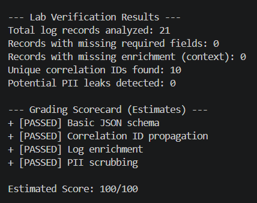
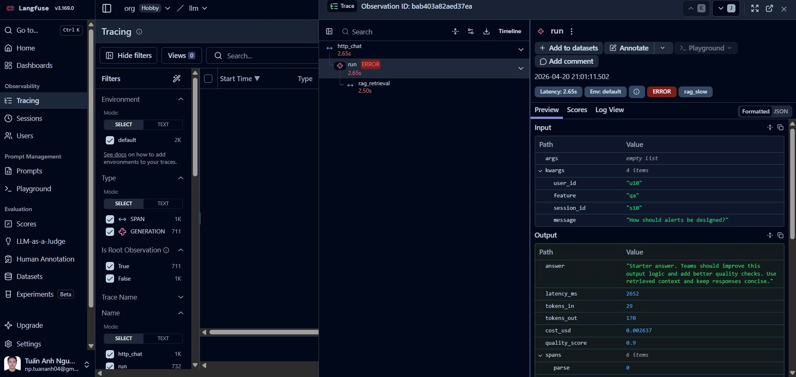
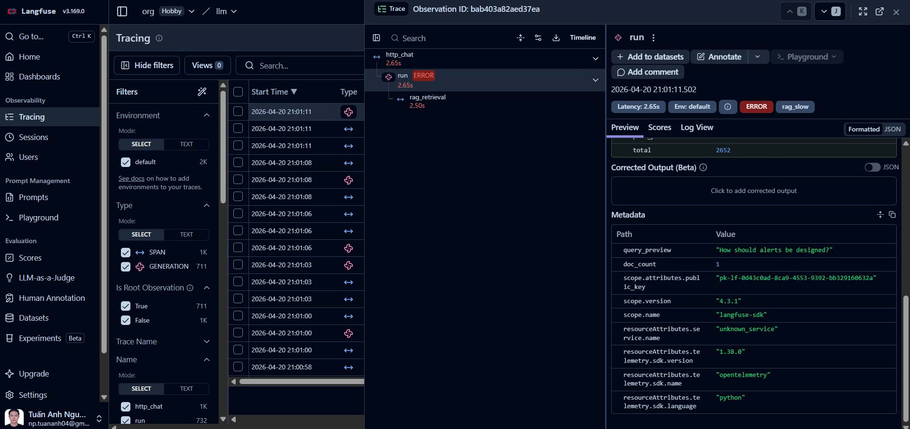
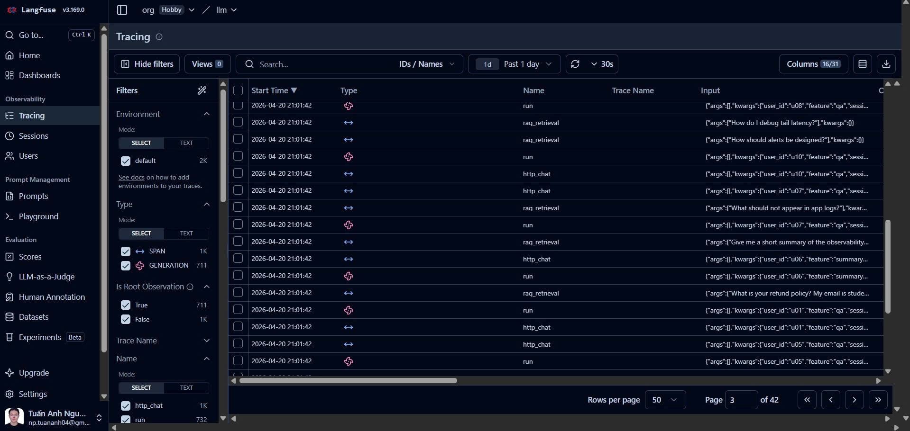
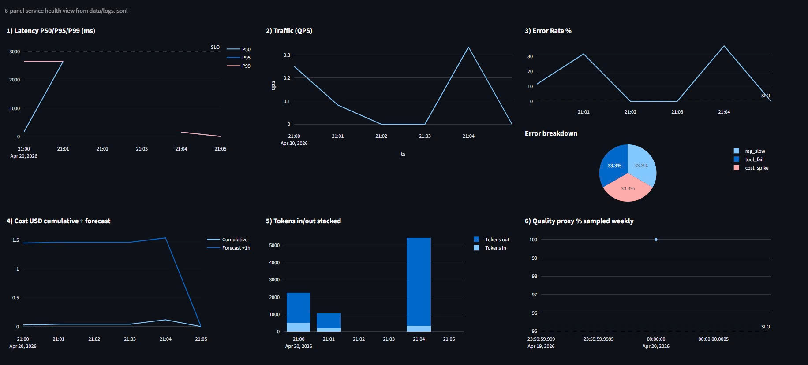
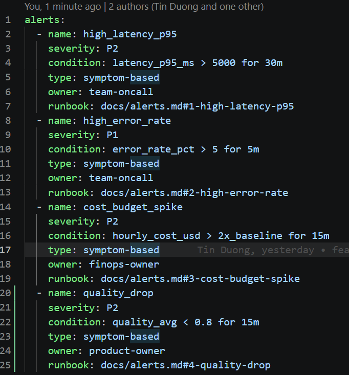

# Day 13 Observability Lab Report

> **Instruction**: Fill in all sections below. This report is designed to be parsed by an automated grading assistant. Ensure all tags (e.g., `[GROUP_NAME]`) are preserved.

## 1. Team Metadata
- [GROUP_NAME]: X1
- [REPO_URL]: https://github.com/CheeseBout/2A202600103_X1_Day13
- [MEMBERS]: Lê Nguyễn Chí Bảo
  - Member A: Lê Nguyễn Chí Bảo, Nguyễn Phan Tuấn Anh | Role: Logging & PII
  - Member B: Lê Nguyễn Chí Bảo | Role: Tracing & Enrichment
  - Member C: Lê Nguyễn Chí Bảo | Role: SLO & Alerts
  - Member D: Nguyễn Phan Tuấn Anh | Role: Load Test & Dashboard
  - Member E: Nguyễn Phan Tuấn Anh(Demo), Lê Nguyễn Chí Bảo(Report) | Role: Demo & Report

---

## 2. Group Performance (Auto-Verified)
- [VALIDATE_LOGS_FINAL_SCORE]: 100/100
- [TOTAL_TRACES_COUNT]: 22
- [PII_LEAKS_FOUND]: 0

---

## 3. Technical Evidence (Group)

### 3.1 Logging & Tracing
- [EVIDENCE_CORRELATION_ID_SCREENSHOT]:  
- [EVIDENCE_PII_REDACTION_SCREENSHOT]: 
- [EVIDENCE_TRACE_WATERFALL_SCREENSHOT]:   
- [TRACE_WATERFALL_EXPLANATION]: Khi kiểm tra response time trung bình câu 0.15s -> >2s check trace thấy span retrieval tốn trung bình 2s, check logs thấy RAG bị chậm (RAG slow)

### 3.2 Dashboard & SLOs
- [DASHBOARD_6_PANELS_SCREENSHOT]: 
- [SLO_TABLE]:
| SLI | Target | Window | Current Value |
|---|---:|---|---:|
| Latency P50/P95/P99 | P95 < 3000ms | 28d | 150.0 / 2651.0 / 2651.0 ms |
| Traffic | - | sample run | 20 requests |
| Error Rate | < 2% | 28d | 100.0% (RuntimeError: 20/20) |
| Cost | < $2.5/day | 1d | avg $0.0021, total $0.0427 |
| Tokens in/out | - | sample run | 680 / 2713 |
| Quality | >= 0.75 | 28d | 0.88 |

### 3.3 Alerts & Runbook
- [ALERT_RULES_SCREENSHOT]: 
- [SAMPLE_RUNBOOK_LINK]: [alert_runbook](alerts.md)

---

## 4. Incident Response (Group)
- [SCENARIO_NAME]: rag_slow
- [SYMPTOMS_OBSERVED]: latency tăng mạnh, nhiều request lên đến 26.5s
- [ROOT_CAUSE_PROVED_BY]: kết quả inject: rag_slow = True, so sánh trước/sau load test (~2.6s bình thường vs ~26.5s khi sự cố)
trace waterfall cho thấy span retrieve/RAG chiếm phần lớn thời gian
- [FIX_ACTION]: Retrieval tuning: giảm timeout cho bước RAG, giới hạn số tài liệu trả về (top-k) và rút ngắn chunk size để giảm thời gian truy xuất. Fallback strategy: nếu retrieve vượt ngưỡng timeout thì chuyển sang nguồn fallback hoặc trả lời chế độ degraded thay vì chờ full RAG.
- [PREVENTIVE_MEASURE]: alert P95 latency + runbook, dashboard theo dõi latency p95/p99 và error rate

- [SCENARIO_NAME_TOOL_FAIL]: tool_fail
- [SYMPTOMS_OBSERVED_TOOL_FAIL]: sau khi inject tool_fail = True, hệ thống vẫn trả 200 cho các request trong bài test, nhưng độ trễ tăng theo batch đầu (khoảng 1.05s đến 1.36s) trước khi ổn định về khoảng 0.62s đến 0.77s.
- [ROOT_CAUSE_PROVED_BY_TOOL_FAIL]: xác nhận bằng phản hồi inject incident (tool_fail = True), đối chiếu log + trace cho thấy nhánh tool có lỗi/tắc nghẽn ngắn hạn và được xử lý fallback nên không làm rơi request hàng loạt. validate_logs.py vẫn PASS 100/100 (không mất enrichment, không rò PII).
- [FIX_ACTION_TOOL_FAIL]: thêm xử lý lỗi rõ ràng cho tool layer (timeout ngắn, retry giới hạn 1-2 lần, circuit-breaker tạm thời khi tỷ lệ lỗi tăng) và ép fallback sang luồng không phụ thuộc tool để giữ API response ổn định.
- [PREVENTIVE_MEASURE_TOOL_FAIL]: theo dõi error_rate + error_breakdown theo loại lỗi tool, alert P1 cho error_rate > 5% trong 5m, runbook yêu cầu disable tool bị lỗi và rollback cấu hình mới nhất nếu có.

- [SCENARIO_NAME_COST_SPIKE]: cost_spike
- [SYMPTOMS_OBSERVED_COST_SPIKE]: sau khi inject cost_spike = True, request vẫn thành công nhưng chi phí/token có xu hướng tăng do prompt/response dài hơn; latency quan sát dao động khoảng 1.42s ở batch đầu và 0.46s đến 0.77s ở các request sau.
- [ROOT_CAUSE_PROVED_BY_COST_SPIKE]: xác nhận bằng phản hồi inject incident (cost_spike = True), đối chiếu metrics cost_usd + tokens_in_total/tokens_out_total và trace metadata cho thấy mức sử dụng token tăng theo feature/model, trong khi validate_logs.py vẫn PASS 100/100.
- [FIX_ACTION_COST_SPIKE]: giảm kích thước prompt đầu vào, giới hạn output tokens theo feature, route các câu hỏi đơn giản sang model rẻ hơn, và áp dụng prompt cache cho các truy vấn lặp để kéo total_cost_usd về ngưỡng ngân sách.
- [PREVENTIVE_MEASURE_COST_SPIKE]: đặt alert cost_budget_spike (hourly_cost_usd > 2x_baseline for 15m), theo dõi dashboard cost + tokens in/out theo thời gian, và rà soát định kỳ các luồng có burn-rate cao.

---

## 5. Individual Contributions & Evidence

### [MEMBER_A_NAME]
- [TASKS_COMPLETED]: 
- [EVIDENCE_LINK]: (Link to specific commit or PR)

### [MEMBER_B_NAME]
- [TASKS_COMPLETED]: 
- [EVIDENCE_LINK]: 

### [MEMBER_C_NAME]
- [TASKS_COMPLETED]: 
- [EVIDENCE_LINK]: 

### [MEMBER_D_NAME]
- [TASKS_COMPLETED]: 
- [EVIDENCE_LINK]: 

### [MEMBER_E_NAME]
- [TASKS_COMPLETED]: 
- [EVIDENCE_LINK]: 

---

## 6. Bonus Items (Optional)
- [BONUS_COST_OPTIMIZATION]: (Description + Evidence)
- [BONUS_AUDIT_LOGS]: (Description + Evidence)
- [BONUS_CUSTOM_METRIC]: (Description + Evidence)
